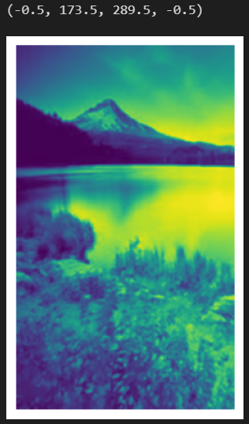
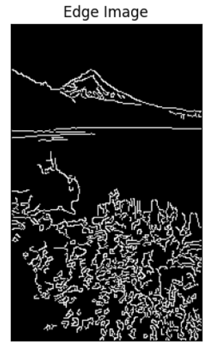
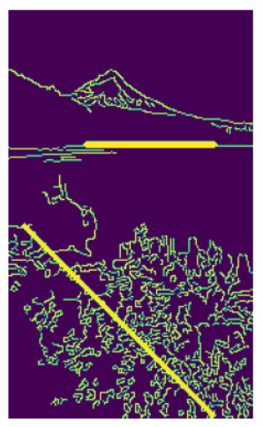

# Edge-Linking-using-Hough-Transform
## Aim:
To write a Python program to detect the lines using Hough Transform.

## Software Required:
Anaconda - Python 3.7

## Algorithm:
### Step1:
Import all the necessary modules for the program.
### Step2:
Load a image using imread() from cv2 module.
### Step3:
Convert the image to grayscale.
### Step4:
Using Canny operator from cv2,detect the edges of the image.
### Step5:
Using the HoughLinesP(),detect line co-ordinates for every points in the images.Using For loop,draw the lines on the found co-ordinates.Display the image.
## Program:


# Read image and convert it to grayscale image
```python
# Developed by:YUVARAJ.S
# Register number:22008589
import cv2
import numpy as np
import matplotlib.pyplot as plt
image1=cv2.imread('images.jpg',0)
img= cv2.GaussianBlur(image1,(3,3),0)
plt.imshow(img)
plt.axis("off")
```


# Find the edges in the image using canny detector and display
```python
# Developed by:YUVARAJ.S
# Register number:22008589
edges1 = cv2.Canny(img,100,200)
plt.imshow(edges1,cmap = 'gray')
plt.title('Edge Image'), plt.xticks([]), plt.yticks([])
plt.show()
```


# Detect points that form a line using HoughLinesP
```python
# Developed by:YUVARAJ.S
# Register number:22008589
lines=cv2.HoughLinesP(edges1,1,np.pi/180, threshold=80, minLineLength=50,maxLineGap=250)
```


# Draw lines on the image
```python
# Developed by:YUVARAJ.S
# Register number:22008589
for line in lines:
    x1, y1, x2, y2 = line [0] 
    cv2.line(edges1,(x1, y1),(x2, y2),(255, 0, 0),3)
```


# Display the result
```python
# Developed by:YUVARAJ.S
# Register number:22008589
plt.imshow(edges1)
```


## Output

### Input image and grayscale image

### Canny Edge detector output



### Display the result of Hough transform


## Result:
Thus the program is written with python and OpenCV to detect lines using Hough transform. 
